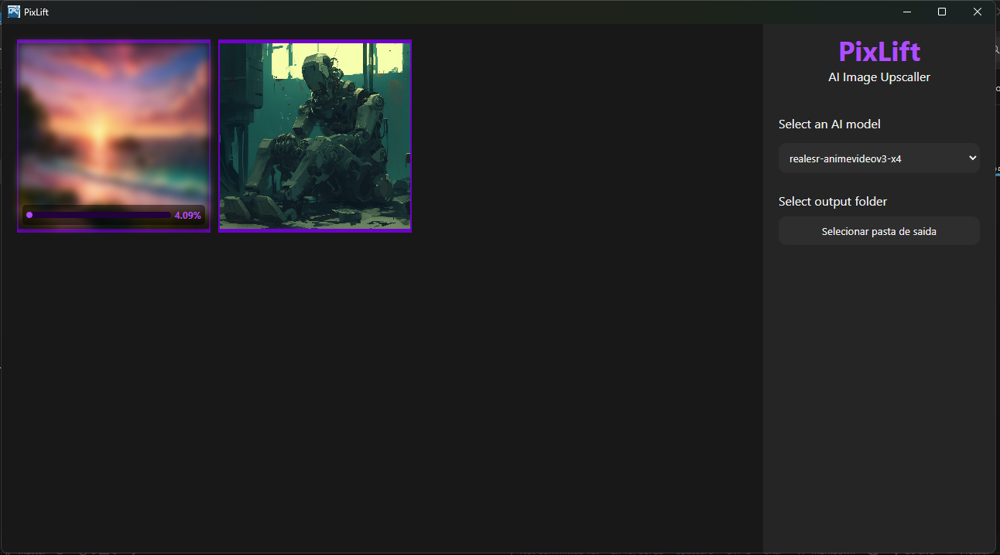

<h1 align="center">📸 PixLift – Upscale de Imagens com IA</h1>

  <strong>Aplicativo desktop para aumento de resolução de imagens usando Inteligência Artificial com Real-ESRGAN e Vulkan</strong>

  

<h2>🚀 Funcionalidades</h2>
<ul>
  <li>Upscale de imagens com modelo Real-ESRGAN</li>
  <li>Interface rápida e moderna com Vite + React + TypeScript</li>
  <li>App desktop multiplataforma com Electron</li>
  <li>Aceleração de GPU com Vulkan</li>
</ul>

<h2>🧩 Tecnologias Utilizadas</h2>
<ul>
  <li><strong>Electron.js</strong> – Aplicações desktop com tecnologias web</li>
  <li><strong>Vite + React + TypeScript</strong> – UI rápida e moderna</li>
  <li><strong>Real-ESRGAN-ncnn-vulkan</strong> – IA para *upscale* com aceleração Vulkan</li>
  <li><strong>Electron Builder</strong> – Empacotamento para distribuição</li>
</ul>

<h2>⚙️ Instalação</h2>

<strong>Pré-requisitos:</strong> Node.js, Git, e Vulkan SDK instalado.

<pre><code># Clone o repositório
git clone https://github.com/seuusuario/pixlift.git
cd pixlift

# Instale as dependências
npm install

# Rode em modo de desenvolvimento
npm run dev
</code></pre>

<h2>📦 Build</h2>
<pre><code># Gera a build de produção
npm run build

# Empacota o app com Electron
npm run electron:build
</code></pre>

<h2>📁 Estrutura do Projeto</h2>
<pre><code>pixlift/
├── public/               # Arquivos estáticos
├── src/
│   ├── components/       # Componentes React
│   ├── main/             # Código principal do Electron
│   ├── renderer/         # Interface do usuário (React)
├── realesrgan/           # Binários e modelos do Real-ESRGAN
├── package.json
└── vite.config.ts
</code></pre>

<h2>🧠 Créditos</h2>
<ul>
  <li><a href="https://github.com/xinntao/Real-ESRGAN-ncnn-vulkan" target="_blank">Real-ESRGAN-ncnn-vulkan</a> – por xinntao</li>
  <li>Equipe do Vite, React, Electron</li>
  <li>Comunidade de código aberto</li>
</ul>

<h2>📃 Licença</h2>

Este projeto está licenciado sob a <strong>MIT License</strong>. Veja o arquivo <code>LICENSE</code> para mais informações.

